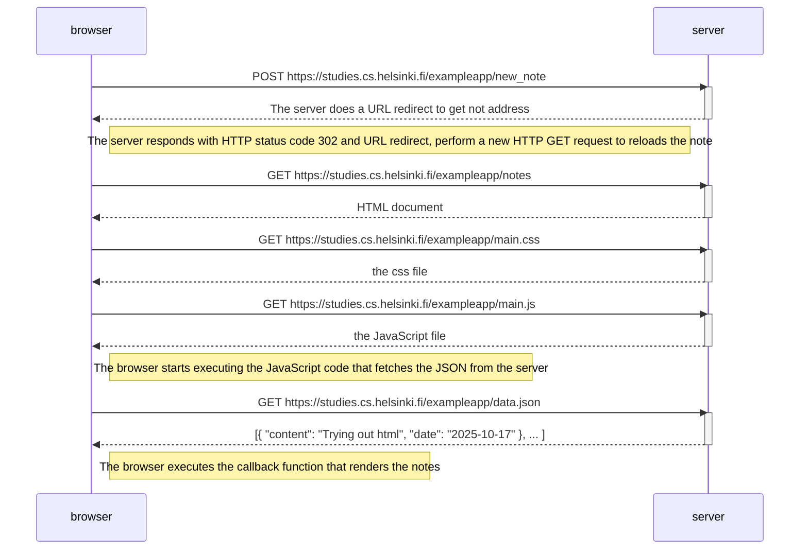

```mermaid
sequenceDiagram
    participant browser
    participant server

     browser->>server: POST https://studies.cs.helsinki.fi/exampleapp/new_note
    activate server
    server-->>browser: The server does a URL redirect to get not address
    deactivate server
    Note right of browser: The server responds with HTTP status code 302 and URL redirect, perform a new HTTP GET request to reloads the note

    browser->>server: GET https://studies.cs.helsinki.fi/exampleapp/notes
    activate server
    server-->>browser: HTML document
    deactivate server

    browser->>server: GET https://studies.cs.helsinki.fi/exampleapp/main.css
    activate server
    server-->>browser: the css file
    deactivate server

    browser->>server: GET https://studies.cs.helsinki.fi/exampleapp/main.js
    activate server
    server-->>browser: the JavaScript file
    deactivate server

    Note right of browser: The browser starts executing the JavaScript code that fetches the JSON from the server

    browser->>server: GET https://studies.cs.helsinki.fi/exampleapp/data.json
    activate server
    server-->>browser: [{ "content": "Trying out html", "date": "2025-10-17" }, ... ]
    deactivate server

    Note right of browser: The browser executes the callback function that renders the notes
```
