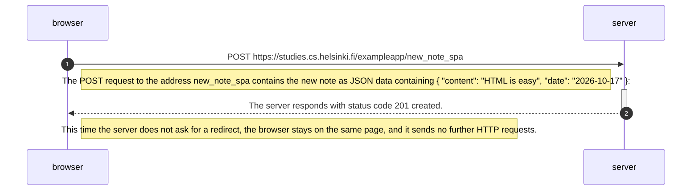

```mermaid
sequenceDiagram
    autonumber
    participant browser
    participant server

    browser->>server: POST https://studies.cs.helsinki.fi/exampleapp/new_note_spa

    Note right of browser: The POST request to the address new_note_spa contains the new note as JSON data containing { "content": "HTML is easy", "date": "2026-10-17" }:

    activate server
    server-->>browser: The server responds with status code 201 created.
    deactivate server


    Note right of browser: This time the server does not ask for a redirect, the browser stays on the same page, and it sends no further HTTP requests.
```
